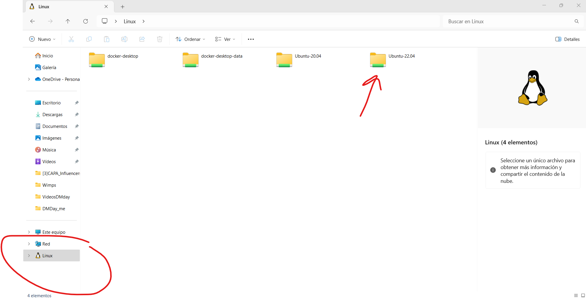

---

# **Instalar Ubuntu en Windows con el Subsistema de Windows para Linux (WSL)**

## **Introducción**

El Subsistema de Windows para Linux (WSL) te permite ejecutar un entorno Linux directamente en Windows, combinando las capacidades de ambos sistemas. Este tutorial te guiará a través de la instalación de Ubuntu en tu equipo Windows utilizando WSL.

---

## **Paso 1: Habilitar el Subsistema de Windows para Linux**

### **1. Abrir PowerShell como Administrador**

- Haz clic en el menú **Inicio**.
- Escribe `PowerShell`.
- Haz clic derecho en **Windows PowerShell** y selecciona **Ejecutar como administrador**.

### **2. Habilitar la Función WSL**

En la ventana de PowerShell, introduce el siguiente comando y presiona **Enter**:

````powershell
dism.exe /online /enable-feature /featurename:Microsoft-Windows-Subsystem-Linux /all /norestart
````

### **3. Habilitar la Plataforma de Máquina Virtual**

Ejecuta el siguiente comando:

````powershell
dism.exe /online /enable-feature /featurename:VirtualMachinePlatform /all /norestart
````

### **4. Reiniciar tu Computadora**

Para que los cambios surtan efecto, reinicia tu computadora.

---

## **Paso 2: Actualizar a WSL 2**

### **1. Descargar el Paquete de Actualización del Kernel de Linux**

- Visita la página de [Actualización del Kernel de WSL2 de Microsoft](https://wslstorestorage.blob.core.windows.net/wslblob/wsl_update_x64.msi).
- Descarga e instala el paquete.

### **2. Establecer WSL 2 como la Versión Predeterminada**

Abre **PowerShell** como administrador y ejecuta:

````powershell
wsl --set-default-version 2
````

---

## **Paso 3: Instalar Ubuntu desde Microsoft Store**

### **1. Abrir Microsoft Store**

- Haz clic en el menú **Inicio**.
- Busca **Microsoft Store** y ábrela.

### **2. Buscar Ubuntu**

- En la barra de búsqueda, escribe **Ubuntu**.
- Procura instalar la última versión.

### **3. Instalar Ubuntu**

- Haz clic en **Instalar**.
- Espera a que se complete la instalación.

---

## **Paso 4: Inicializar Ubuntu**

### **1. Lanzar Ubuntu**

- Haz clic en **Iniciar** desde Microsoft Store o encuentra Ubuntu en el menú **Inicio**.

### **2. Configurar tu Nombre de Usuario y Contraseña de Linux**

- Una vez hayas entrado a Ubuntu, introduce un **nombre de usuario** (por ejemplo, `fran`).
- Introduce una **contraseña** (los caracteres no aparecerán mientras escribes).

---

## **Paso 5: Actualizar y Mejorar los Paquetes**

### **1. Actualizar las Listas de Paquetes**

En la terminal de Ubuntu, ejecuta:

````bash
sudo apt update
````

- Introduce tu contraseña cuando se te solicite.

### **2. Mejorar los Paquetes Instalados**

Ejecuta:

````bash
sudo apt upgrade
````

- Escribe `y` y presiona **Enter** para confirmar.

---

## **Paso 6: Verificar la Versión de WSL (Opcional)**

### **1. Comprobar la Versión de WSL**

En **PowerShell**, ejecuta:

````powershell
wsl --list --verbose
````

- Asegúrate de que Ubuntu esté ejecutándose bajo **Versión 2**.

### **2. Establecer Ubuntu a WSL 2 si es Necesario**

Si no es así, configúralo manualmente:

````powershell
wsl --set-version Ubuntu 2
````

---

## **Paso 7: Acceder a Archivos entre Windows y Linux**

### **1. Acceder a Archivos de Windows desde Ubuntu**

- Las unidades de Windows están montadas en `/mnt/`.
- Ejemplo para acceder a la unidad C:

````bash
cd /mnt/c/
````

### **2. Acceder a Archivos de Linux desde Windows**

- Abre el **Explorador de Archivos**.
- Introduce la siguiente ruta:

````plaintext
\\wsl$\Ubuntu\home\TuNombreDeUsuarioLinux
````
### **3. La forma más sencilla**
Accede al Ecplorador de archivos. Abajo del todo te debería aparecer un pingüinito, clicka en él y te debería aparecer la carpeta de Ubuntu. Si vas a home/usuario/ ahí se enceuntra tu espacio de trabajo.

---

## **Finalizado**

Has instalado exitosamente Ubuntu en tu computadora Windows utilizando WSL. Ahora puedes ejecutar comandos de Linux, instalar paquetes y desarrollar aplicaciones en un entorno Linux directamente desde Windows.

---

## **Recursos Adicionales**

- **Documentación Oficial de WSL:** [Microsoft Docs - WSL](https://docs.microsoft.com/es-es/windows/wsl/)
- **Ubuntu en WSL:** [Documentación de Ubuntu](https://ubuntu.com/wsl)

---

